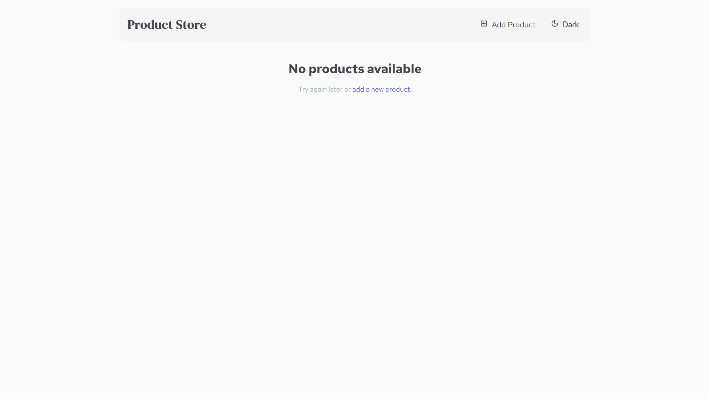
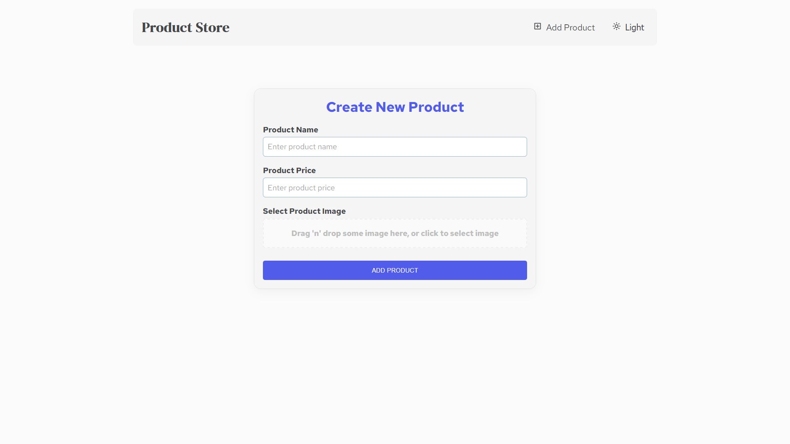
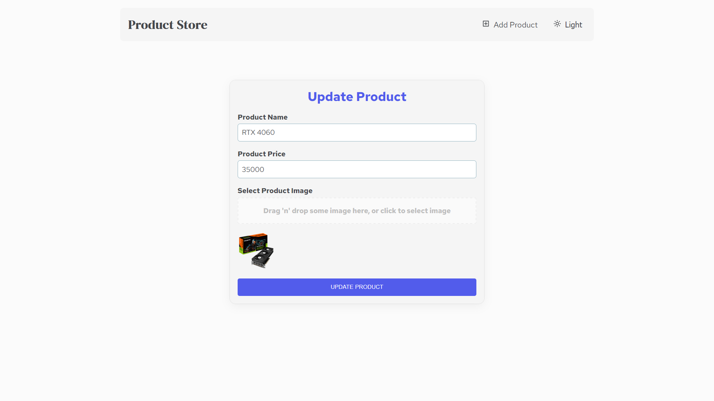
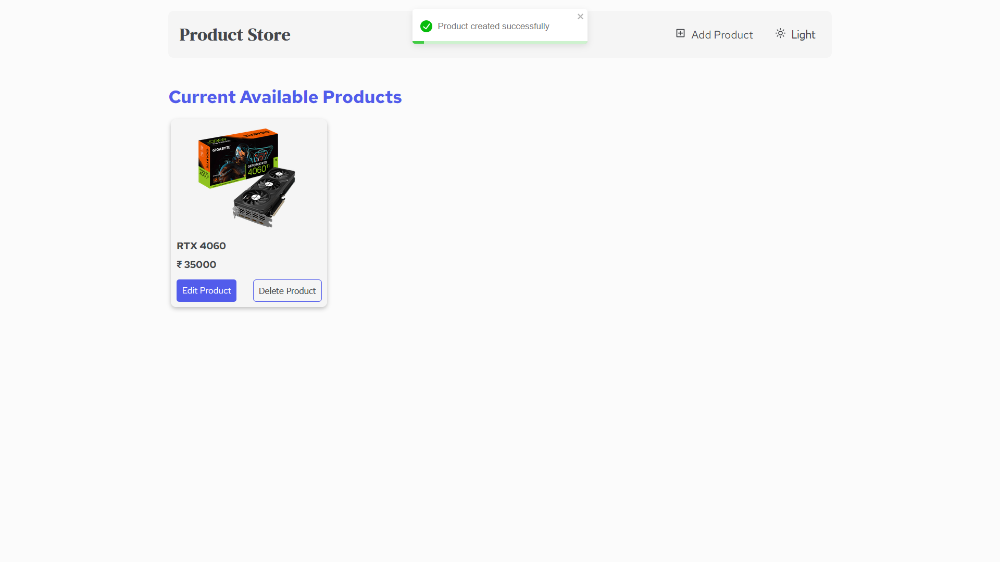

# Product Store

## Project Description

The Product Store is a simple e-commerce application that allows users to browse, create, update, and delete products. It serves as a practice project for learning and implementing MERN (MongoDB, Express.js, React, Node.js) stack concepts.

## Table of Contents
- [Product Store](#product-store)
  - [Project Description](#project-description)
  - [Table of Contents](#table-of-contents)
  - [Repository \& Live Demo](#repository--live-demo)
  - [Features](#features)
  - [Technology Stack](#technology-stack)
  - [Prerequisites](#prerequisites)
  - [Installation Instructions](#installation-instructions)
  - [Usage](#usage)
  - [Folder Structure](#folder-structure)
    - [Backend](#backend)
    - [Frontend](#frontend)
  - [API Documentation](#api-documentation)
  - [Screenshots](#screenshots)
    - [🏠 Home Page](#-home-page)
    - [➕ Create Product Page](#-create-product-page)
    - [✏️ Update Product Page](#️-update-product-page)
    - [📄 Product Details Page](#-product-details-page)
  - [Contact Information](#contact-information)

## Repository & Live Demo

  - Repository URL: [Product Store GitHub Repo](https://github.com/Rajiv-0920/Product-Store)
  - Live Demo: [Product Store Live Demo](https://product-store-1-losf.onrender.com/)
  
## Features

-   **Browse Products**: View a list of available products.
-   **Create Products**: Add new products to the store.
-   **Update Products**: Modify existing product details.
-   **Delete Products**: Remove products from the store.
-   **Responsive Design**: The application is designed to be responsive and work on different screen sizes.
-   **Image Upload**: Upload images for products using the `DropZone` component.

## Technology Stack

-   **MERN Stack**:
    -   **MongoDB**: Database to store product information.
    -   **Express.js**: Backend framework for creating APIs.
    -   **React**: Frontend library for building the user interface.
    -   **Node.js**: Runtime environment for executing JavaScript server-side.
-   **Additional Libraries/Tools**:
    -   `axios`: For making HTTP requests.
    -   `cloudinary`: For image storage and management.
    -   `cors`: For handling Cross-Origin Resource Sharing.
    -   `dotenv`: For managing environment variables.
    -   `mongoose`: For MongoDB object modeling.
    -   `@mui/material`: For UI components.
    -   `react-router-dom`: For routing in React.
    -   `react-toastify`: For displaying toast notifications.
    -   `vite`: For frontend building and development.

## Prerequisites

Before running the project, ensure you have the following installed:

-   **Node.js**: [Download and Install](https://nodejs.org/)
-   **npm** (Node Package Manager): Usually comes with Node.js installation.
-   **MongoDB**: [Download and Install](https://www.mongodb.com/try/download/community)

## Installation Instructions

Follow these steps to get the project running locally:

1.  **Clone the repository**:

    ```bash
    git clone <repository_url>
    cd Practice Product Store
    ```

2.  **Install backend dependencies**:

    ```bash
    cd backend
    npm install
    ```

3.  **Install frontend dependencies**:

    ```bash
    cd ../frontend
    npm install
    ```

4.  **Set up environment variables**:

    -   Create a `.env` file in the `backend` directory.
    -   Add the following variables:

        ```
        PORT=5000
        MONGO_URI=<your_mongodb_connection_string>
        CLOUDINARY_CLOUD_NAME=<your_cloudinary_cloud_name>
        CLOUDINARY_API_KEY=<your_cloudinary_api_key>
        CLOUDINARY_API_SECRET=<your_cloudinary_api_secret>
        ```

    -   Replace the placeholders with your actual MongoDB connection string and Cloudinary credentials.

5.  **Run the project**:

    -   To start the backend server:

        ```bash
        cd ../backend
        npm run dev
        ```

    -   To start the frontend development server:

        ```bash
        cd ../frontend
        npm run dev
        ```

    -   Alternatively, to run the project in production mode:

        ```bash
        npm run start
        ```

        This command builds the frontend and serves the application from the backend.

## Usage

1.  Open your browser and navigate to `http://localhost:5173` (or the appropriate port if different).
2.  You should see the list of available products.
3.  Use the navigation links to:
    -   **Add Product**: Click on "Add Product" to create a new product.
    -   **Edit Product**: Click on "Edit Product" on a product card to update its details.
    -   **Delete Product**: Click on "Delete Product" on a product card to remove it.

## Folder Structure

### Backend

  ```bash
  backend/
  ├── config/ # Database configuration
  ├── controllers/ # Route handlers
  ├── lib/ # Utility functions (e.g., Cloudinary)
  ├── models/ # Data models
  ├── routes/ # API routes
  ├── server.js # Main server file
  └── package.json # Backend dependencies and scripts
  ```

### Frontend

  ```bash
  frontend/
  ├── src/
  │ ├── api/ # API client
  │ ├── components/ # React components
  │ ├── layouts/ # Layout components 
  │ ├── pages/ # React pages 
  │ ├── routes/ # React Router configuration 
  │ ├── utils/ # Utility functions 
  │ ├── main.jsx # Entry point for React 
  │ └── main.css # Global styles 
  ├── index.html # HTML entry point 
  ├── vite.config.js # Vite configuration 
  ├── package.json # Frontend dependencies and scripts 
  └── .env # Environment variables
  ```


## API Documentation

The backend exposes the following API endpoints:

-   **GET /api/products**:
    -   Description: Retrieve all products.
    -   Method: `GET`
    -   Response:

        ```json
        {
            "success": true,
            "data": [
                {
                    "_id": "6636d398b3c88ff4a14e4a4a",
                    "name": "Sample Product",
                    "price": 29.99,
                    "image": "https://example.com/sample.jpg",
                    "createdAt": "2024-05-05T18:30:00.000Z",
                    "updatedAt": "2024-05-05T18:30:00.000Z",
                    "__v": 0
                }
            ]
        }
        ```

-   **GET /api/products/:id**:
    -   Description: Retrieve a single product by ID.
    -   Method: `GET`
    -   Parameters:
        -   `id` (string): The ID of the product.
    -   Response:

        ```json
        {
            "success": true,
            "data": {
                "_id": "6636d398b3c88ff4a14e4a4a",
                "name": "Sample Product",
                "price": 29.99,
                "image": "https://example.com/sample.jpg",
                "createdAt": "2024-05-05T18:30:00.000Z",
                "updatedAt": "2024-05-05T18:30:00.000Z",
                "__v": 0
            }
        }
        ```

-   **POST /api/products**:
    -   Description: Create a new product.
    -   Method: `POST`
    -   Request Body:

        ```json
        {
            "name": "New Product",
            "price": 39.99,
            "image": "data:image/jpeg;base64,/9j/4AAQSkZJRgABAQ..."
        }
        ```

    -   Response:

        ```json
        {
            "success": true,
            "data": {
                "_id": "6636d398b3c88ff4a14e4a4b",
                "name": "New Product",
                "price": 39.99,
                "image": "https://example.com/new.jpg",
                "createdAt": "2024-05-05T18:35:00.000Z",
                "updatedAt": "2024-05-05T18:35:00.000Z",
                "__v": 0
            }
        }
        ```

-   **PATCH /api/products/:id**:
    -   Description: Update an existing product.
    -   Method: `PATCH`
    -   Parameters:
        -   `id` (string): The ID of the product to update.
    -   Request Body:

        ```json
        {
            "name": "Updated Product Name",
            "price": 49.99
        }
        ```

    -   Response:

        ```json
        {
            "success": true,
            "data": {
                "_id": "6636d398b3c88ff4a14e4a4a",
                "name": "Updated Product Name",
                "price": 49.99,
                "image": "https://example.com/sample.jpg",
                "createdAt": "2024-05-05T18:30:00.000Z",
                "updatedAt": "2024-05-05T18:40:00.000Z",
                "__v": 0
            }
        }
        ```

-   **DELETE /api/products/:id**:
    -   Description: Delete a product.
    -   Method: `DELETE`
    -   Parameters:
        -   `id` (string): The ID of the product to delete.
    -   Response:

        ```json
        {
            "success": true,
            "message": "Product deleted"
        }
        ```

## Screenshots

### 🏠 Home Page


### ➕ Create Product Page


### ✏️ Update Product Page


### 📄 Product Details Page



## Contact Information

For questions or support, please contact:

- **Rajiv Kumar**
- **Email:** kumarrajiv0920@gmail.com
- **GitHub:** [My GitHub Profile](https://github.com/Rajiv-0920)
- **Linkedin:** [Connect with me on LinkedIn](www.linkedin.com/in/rajivkumar0920)